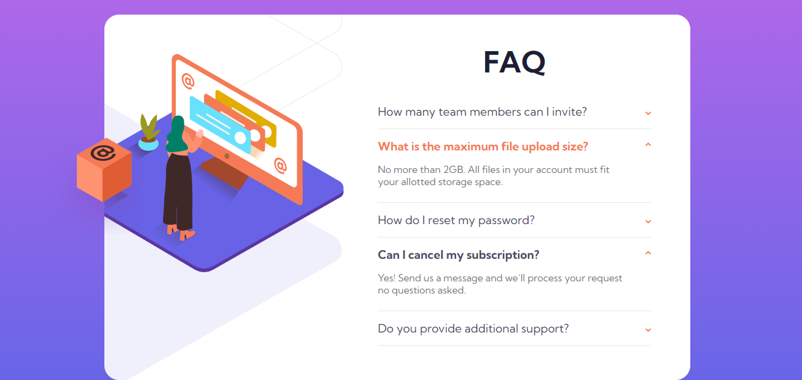
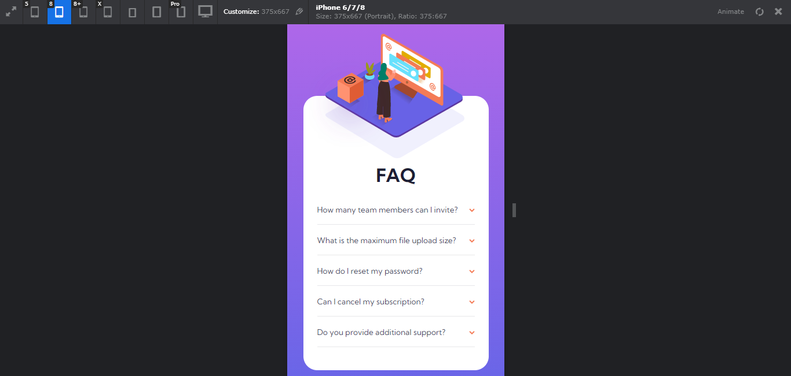
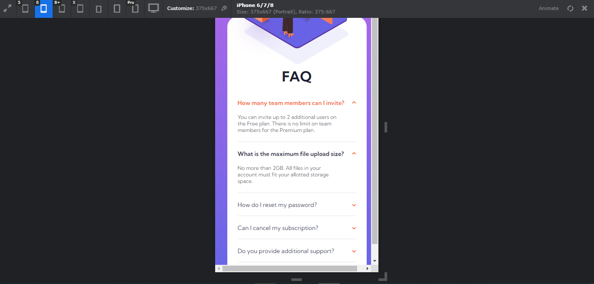

# Frontend Mentor - FAQ accordion card solution

This is a solution to the [FAQ accordion card challenge on Frontend Mentor](https://www.frontendmentor.io/challenges/faq-accordion-card-XlyjD0Oam).

## Table of contents

- [Overview](#overview)
  - [The challenge](#the-challenge)
  - [Screenshot](#screenshot)
  - [Links](#links)
- [My process](#my-process)
  - [Built with](#built-with)
  - [What I learned](#what-i-learned)
  - [Useful resources](#useful-resources)
- [Author](#author)

## Overview

### The challenge

Users should be able to:

- View the optimal layout for the component depending on their device's screen size
- See hover states for all interactive elements on the page
- Hide/Show the answer to a question when the question is clicked

### Screenshot







### Links

- Solution URL: [https://github.com/hoangnam-nguyen/faq-accordion-card](https://github.com/hoangnam-nguyen/faq-accordion-card)
- Live Site URL: [https://hoangnam-nguyen.github.io/faq-accordion-card/](https://hoangnam-nguyen.github.io/faq-accordion-card/)

## My process

### Built with

- Semantic HTML5 markup
- CSS Flexbox and more
- Mobile-first workflow
- JavaScript


### What I learned

- Position background image outside of its container

```css
.image-box {
    display: block;
    position: absolute;
    top: 12.5rem;
    left: -6rem;
    width: 10rem;
    height: 10rem;
    background: url('images/illustration-box-desktop.svg') no-repeat;
    z-index: 1000;
}
```

- Position multiple images within their container. Setting image's width and height should be precise to avoid overflow.

```css
.image {
    position: absolute;
    top: 0;
    left: 0;
    width: 55%;
    height: 100%;
    background: 
        url('images/illustration-woman-online-desktop.svg') -5rem 4rem no-repeat,
        url('images/bg-pattern-desktop.svg') -36rem -18rem no-repeat;
    z-index: 100;
}
```

- Toggle a class using JavaScript (this does not work with getElementsByClassName)

```js
const boxes = document.querySelectorAll('.boxContent');

boxes.forEach(box => {
  box.addEventListener('click', () => {
    box.classList.toggle('active');
  })
})
```

- Add horizontal line and symbol after div.

```css
.boxContent::after {
    content: '';
    display: block;
    width: 100%;
    height: 1px;
    background-color: var(--clr-neutral-light);
}

.title::after {
    content: url('images/icon-arrow-down.svg');
    position: absolute;
    right: 1.5rem;
    transition: 500ms;
}
```

- Build accordion functionality.

```css
.content {
    position: relative;
    height: 0;
    overflow: hidden;
    overflow-y: hidden;
    transition: 500ms;
}

.active .content {
    height: 5rem;
}
```

### Useful resources

- [How to create an Accordion using CSS & Javascript](https://www.youtube.com/watch?v=dPLHi7tsoFU) - This Youtube tutorial helped me create an accordion functionality for the first time.
- [Simple solutions to responsive typography](https://www.youtube.com/watch?v=wARbgs5Fmuw&t=1s) - In Youtube video, Kevin simplifies the process of using media queries to dynamically change font-size to match different screen sizes. This is an amazing trick for every front-end developer.

## Author

- GitHub - [Nguyen Hoang Nam](https://github.com/hoangnam-nguyen)
- Frontend Mentor - [@hoangnam-nguyen](https://www.frontendmentor.io/profile/hoangnam-nguyen)
- CodePen - [@hoangnam-nguyen](https://codepen.io/hoangnam-nguyen)

